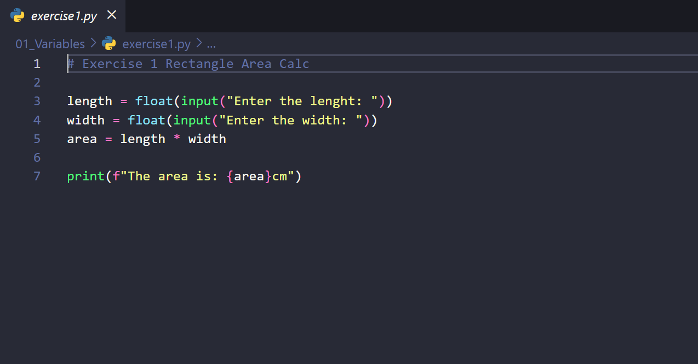
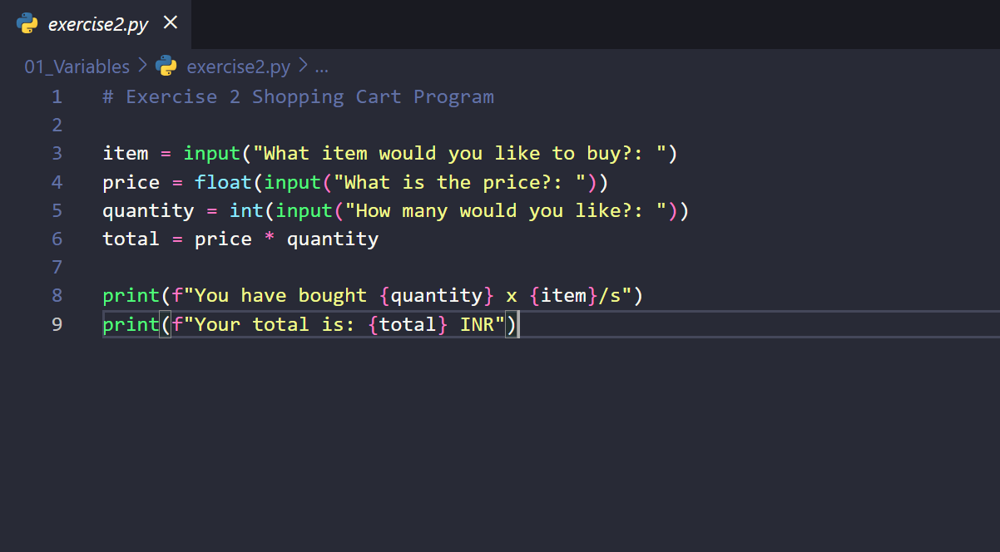

# 🐍 Python Exercises Repository


Welcome! This repository contains **Python programs I’ve solved while learning**.  
It is organized by topics for clarity and to track my learning progress efficiently.  

---

## 📂 Folder Structure

```
01_Variables/
   ├── exercise1.py       # Rectangle Area Calculator
   └── exercise2.py       # Shopping Cart Program

02_Conditional_Statements/
   └── (empty for now)

03_Loops/
   └── (empty for now)

04_Functions/
   └── (empty for now)

05_Lists_Dictionaries/
   └── (empty for now)

06_File_Handling/
   └── (empty for now)
```

---

## 📝 About the Exercises

- **01_Variables** → Programs using basic variables, input/output, and arithmetic calculations.  
- **02_Conditional_Statements** → Programs using `if`, `elif`, `else` (empty for now).  
- **03_Loops** → Programs using `for` and `while` loops (empty for now).  
- **04_Functions** → Programs demonstrating functions and modular code (empty for now).  
- **05_Lists_Dictionaries** → Programs using Python lists and dictionaries (empty for now).  
- **06_File_Handling** → Programs related to reading/writing files in Python (empty for now).  

---

## 🚀 How to Run

1. **Clone the repository:**

```bash
git clone https://github.com/abjaiyad/Python-Exercises.git
```

2. **Navigate to the folder of the exercise you want to run:**

```bash
cd "01_Variables"
```

3. **Run the Python program:**

```bash
python exercise1.py
```

---

## 🖼 Screenshots of Programs

### Rectangle Area Calculator (exercise1.py)


### Shopping Cart Program (exercise2.py)


> Make sure the images are in the `screenshots` folder relative to README.md.

---

## 📌 Future Updates

- More exercises will be added under the appropriate topic folders.  
- Exercises will always follow the folder structure for easy navigation.  

---

## 💡 Notes

- Each exercise file is clearly named to indicate the topic.  
- Programs are beginner-friendly and follow Python best practices wherever possible.  

---

## 📫 Contact

- GitHub: [https://github.com/abjaiyad](https://github.com/abjaiyad)

*Made with ❤️ by Amad Bin Jaiyad*
