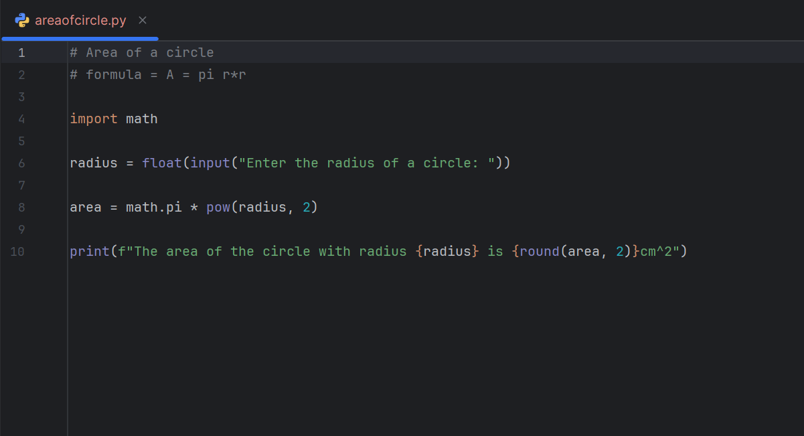
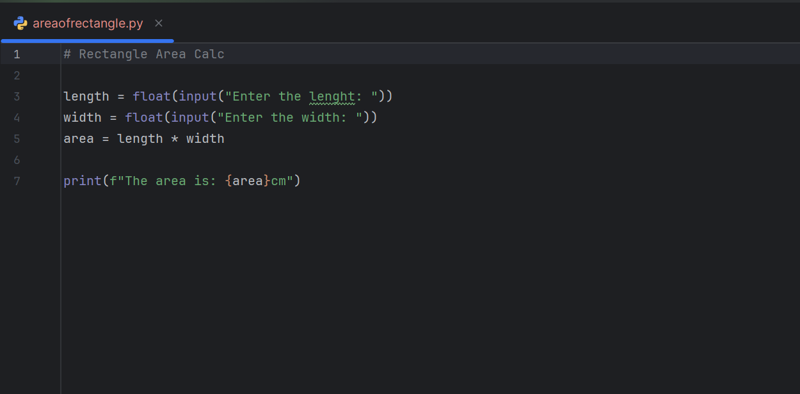
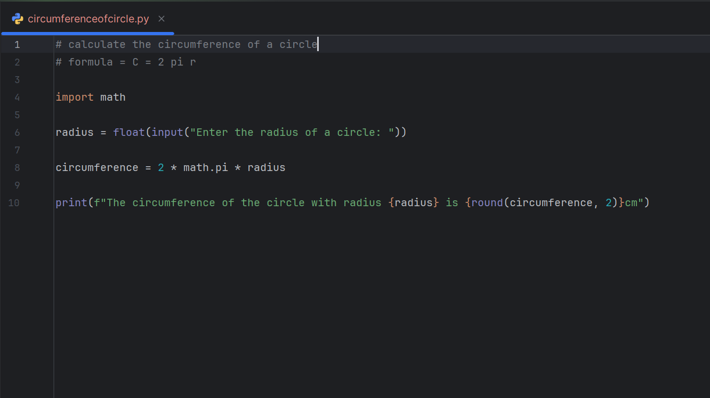
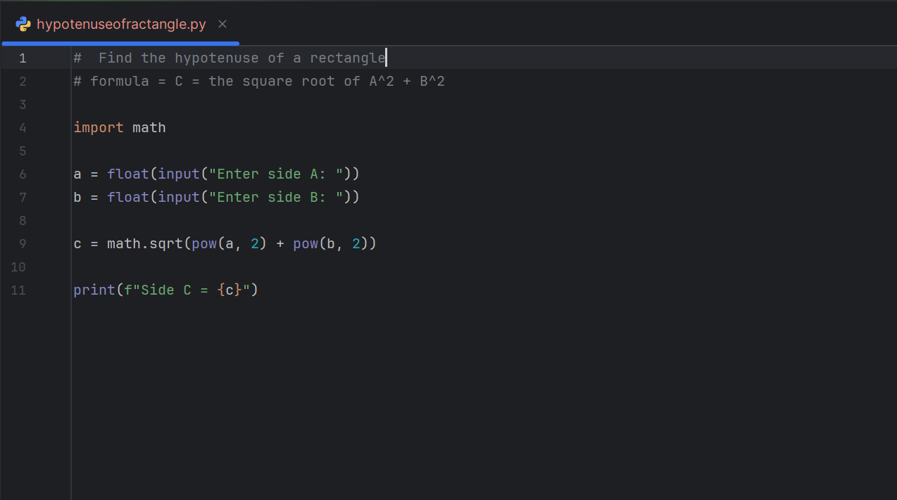
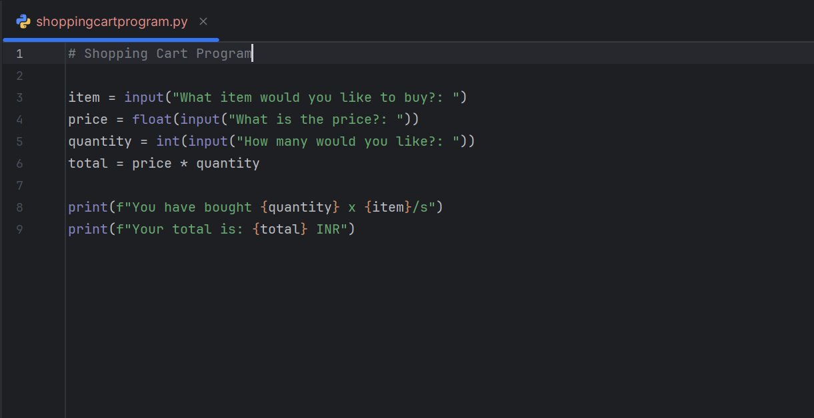
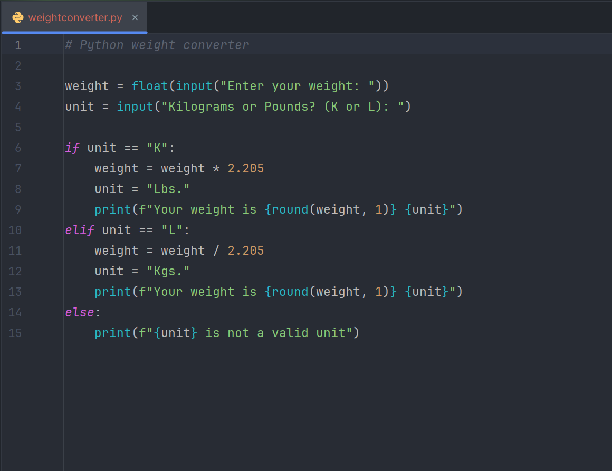
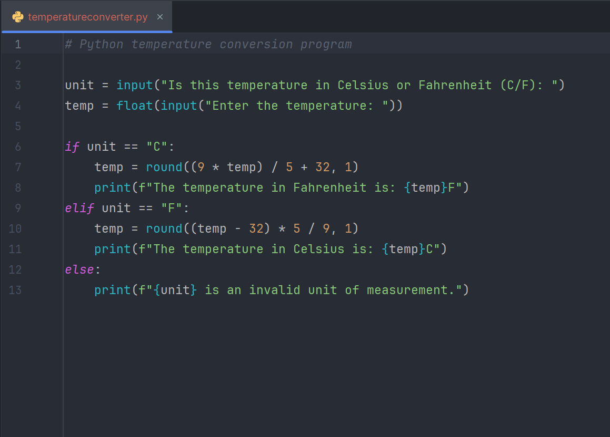
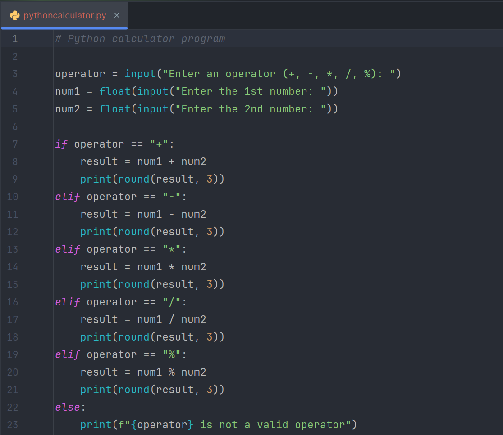
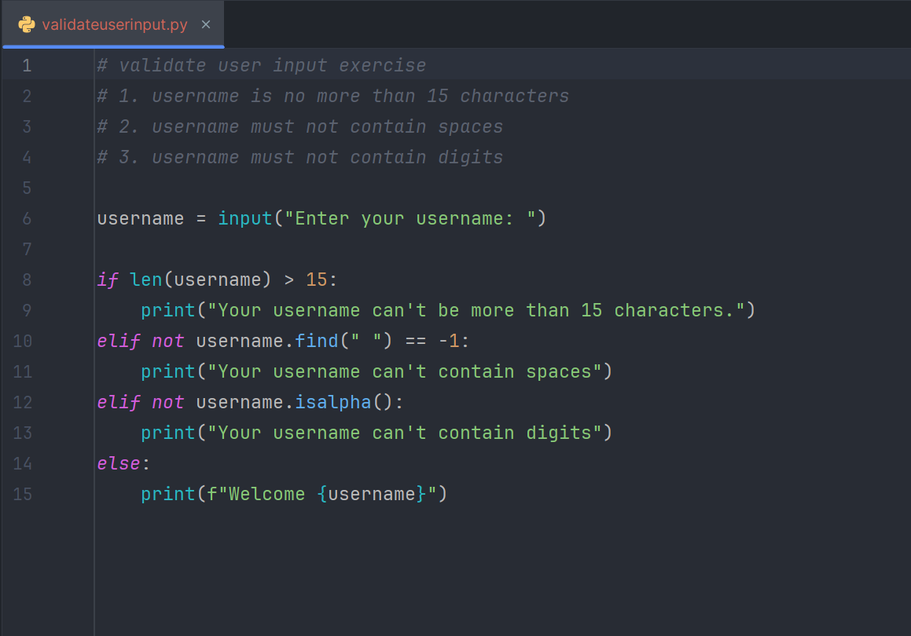

# Python Exercises


Welcome to the **Python Exercises** repository! This repository contains my solved Python practice projects, from beginner to advanced exercises. I will continuously add new programs here, so stay tuned for updates.

---

## 📂 Exercises Gallery

Here are my Python programs with screenshots:

<div align="center">

**Area of Circle**  


**Area of Rectangle**  


**Circumference of Circle**  


**Hypotenuse of Rectangle**  


**Shopping Cart Program**  


**Weight Conversion Program**  


**Temperature Conversion Program**  


**Python Calculator Program**  


**Validate User Input**  


</div>

---

## 🚀 How to Run

1. **Clone the repository**:

```bash
git clone https://github.com/abjaiyad/PythonExercises.git
